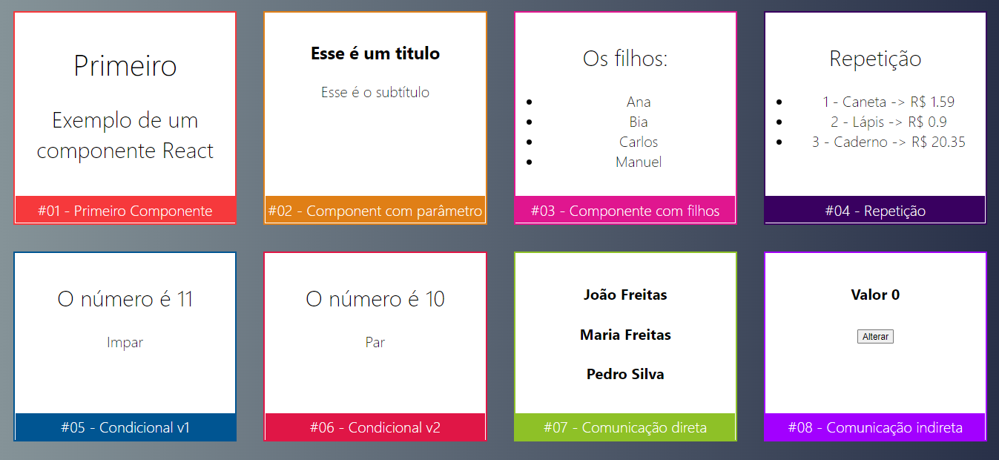

<h1 align="center">
  
</h1>

Este projeto foi inicializado com [Create React App](https://github.com/facebook/create-react-app).

Ele aborda uso de componentes com parâmetros, com filhos, com lista e o método map, além de outros métodos (ex: sort, reduce, fill), recursividade, condicionais, comunicação entre componentes por props, valores com estado, uso de eventos de formulário, incremento e decremento de valores em React.
